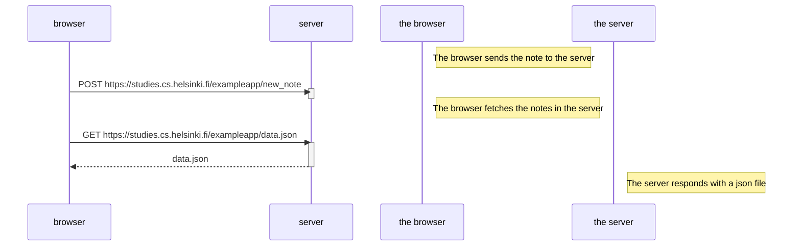

# Sequence diagram for exercise 0.1

```mermaid
sequenceDiagram
    participant browser
    participant server

    Note right of the browser: The browser sends the note to the server

    browser->>server: POST https://studies.cs.helsinki.fi/exampleapp/new_note
    activate server
    deactivate server

    Note right of the browser: The browser fetches the notes in the server

    browser->>server: GET https://studies.cs.helsinki.fi/exampleapp/data.json
    activate server
    server-->>browser: data.json
    deactivate server

    Note right of the server: The server responds with a json file
```
